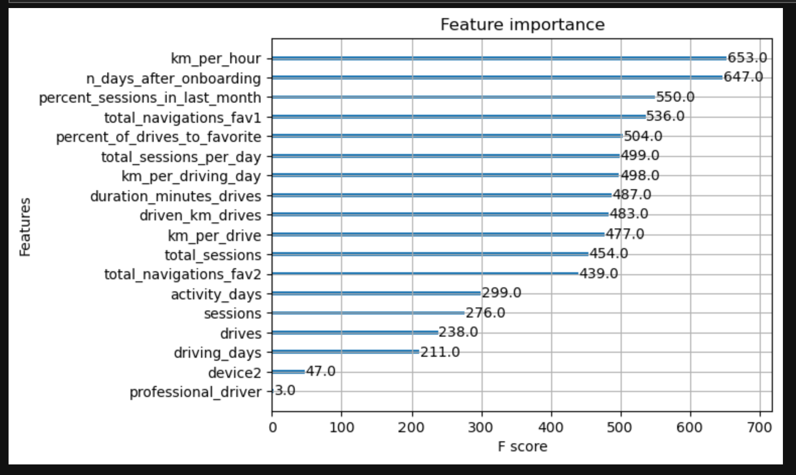

# Waze Churn Prediction: Machine Learning for User Retention

## Acknowledgment

This project was developed as part of the **[Google Advanced Data Analytics Specialization Certificate](https://coursera.org/share/b0a21874c636bdb3b212ad15979debc7)** on Coursera. It was created as a practice project to apply the skills learned during the course, focusing on advanced data analytics techniques such as regression modeling and machine learning.

## Project Overview
This project aims to predict user churn for Waze by utilizing a variety of machine learning models. The primary goal is to develop an accurate predictive model that can identify users at risk of churning and provide actionable insights for the Waze data team to improve retention strategies. The project includes data exploration, statistical testing, and machine learning model development using churn-related data.

## Business Understanding
Waze, a widely used navigation app, faces the challenge of user retention in a competitive market. Predicting which users are likely to stop using the app (churn) allows Waze to take proactive measures to retain users. This project focuses on building a predictive model that helps Waze leadership identify churn risk and develop data-driven strategies to increase user retention.

## Data Understanding
The dataset used for this project, `waze_dataset.csv`, contains synthetic data created in collaboration with Waze to simulate real-world user behavior. The dataset consists of 14,999 rows, where each row represents a unique Waze user, and 13 columns, capturing various attributes related to user behavior, app interactions, and driving habits. The target variable, "label," indicates whether the user has churned or been retained over the course of a month.

### Data Exploration
Initial data exploration involved examining each feature to assess its distribution and impact on the target variable, "label" (churn vs. retained). The dataset includes a mix of categorical and numerical variables that describe user engagement with the app (e.g., sessions, navigations, and driving metrics). Special attention was given to identifying outliers, missing values, and potential correlations between features.

### Data Limitations
- **Synthetic Data**: Since the dataset is synthetic, it mirrors real-world data but may not capture the full complexity of actual user behaviors.
- **Missing Values**: Some columns had missing values that required handling during the data cleaning phase.
- **Outliers**: Several features contained outliers that were addressed through statistical techniques to avoid skewing the model results.
- **Feature Engineering Needs**: The textual data (e.g., label and device) requires extensive preprocessing and feature engineering to be effectively used in model training.

## Project Structure
The project is divided into several key phases, with each phase stored in its respective folder. Below is a breakdown of the tasks included in each step of the project:

### 1. Project Proposal
- Assign PACE (Project, Activity, Commitment, Event) stages to the requested tasks for the user churn project.
- Organize tasks into milestones.
- Create a project proposal for the Waze data team.

### 2. Understand the Data
- Import and inspect the Waze churn data.
- Create a dataframe for further analysis.
- Identify outliers and data inconsistencies.
- Create visualizations to explore data distributions.
- Share an executive summary of the data with the Waze data team.

### 3. Exploratory Data Analysis (EDA)
- Clean and preprocess the Waze churn data.
- Handle outliers and missing values.
- Perform exploratory data analysis to understand trends and patterns.
- Visualize key features and relationships.
- Present an executive summary to the Waze data team with insights from the EDA.

### 4. Statistical Tests
- Compute descriptive statistics for the key variables.
- Conduct a two-sample hypothesis test to assess the statistical significance of differences between user segments (churners vs. non-churners).
- Share findings with Waze leadership in an executive summary.

### 5. Regression Modeling
- Check model assumptions for logistic regression.
- Build a binomial logistic regression model to predict user churn.
- Evaluate the model based on metrics like accuracy, precision, and recall.
- Share an executive summary of the model’s results and recommendations with Waze leadership.

### 6. Machine Learning Models
- Perform feature engineering to enhance model performance.
- Build machine learning models including **Random Forest** and **XGBoost** to predict churn.
- Evaluate model performance using metrics like F1-score and AUC-ROC.
- Share an executive summary of the machine learning models' performance and the best-performing model with Waze leadership.

## Modeling and Evaluation
The project explored both traditional regression modeling and machine learning techniques.

### 1. Logistic Regression
A binomial logistic regression model was developed to predict user churn. The model was evaluated using accuracy, precision, and recall, with a particular focus on recall to capture churned users. 

Key findings:
- The model showed **mediocre precision** (53%) and **very low recall** (9%), indicating that it failed to identify many churned users and had a high number of false negatives.
- The most significant feature was **activity_days**, which had a negative correlation with user churn, meaning users who were more active in the app were less likely to churn.
  
While the model provides some insights, particularly around the need for more churn-related features, it is not reliable enough for making significant business decisions in its current state.

### 2. Random Forest and XGBoost
Two machine learning models, **Random Forest** and **XGBoost**, were developed and compared to predict user churn. The data was split into training, validation, and test sets for more robust model evaluation. 

Key findings:
- **XGBoost** outperformed Random Forest, achieving a recall of 17%, nearly double that of the logistic regression model, while maintaining similar accuracy and precision.
- Engineered features, such as **km_per_hour** and **percent_sessions_in_last_month**, were among the top predictors.
- Although these tree-based models performed better across all metrics, they are more complex and less interpretable than logistic regression.

#### Feature Importance
The XGBoost model’s feature importance provides valuable insights into which factors were most influential in predicting churn. The top features include:
- **km_per_hour**: A key indicator of user engagement.
- **n_days_after_onboarding**: Time since onboarding as a major factor in churn likelihood.
- **percent_sessions_in_last_month**: Engagement over the last month as a crucial churn predictor.

The plot below shows the importance of the top features based on their F-scores:

## Conclusion
This project successfully developed machine learning models to predict user churn for Waze, with XGBoost achieving the best performance. While the models provided valuable insights, the overall prediction accuracy remains limited by the current dataset. Key predictors such as **km_per_hour** and **n_days_after_onboarding** played a significant role, but the models highlighted the need for more granular data, such as drive-level details and user interactions, to improve accuracy. 

Further iterations of the project should focus on feature expansion and gathering additional data to enhance the predictive power of the models, enabling Waze to better identify at-risk users and develop targeted retention strategies.
